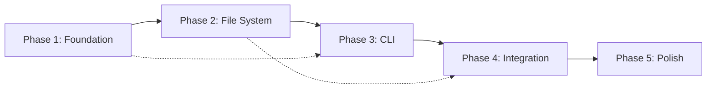

# Contract-First Scaffold - Multi-Phase Action Plan

**Version**: 1.0.0
**Created**: 2025-12-19
**Status**: Ready for Execution
**Total Duration**: 10-12 Weeks

---

## Executive Overview

```
┌─────────────────────────────────────────────────────────────────────────────┐
│                    CONTRACT-FIRST SCAFFOLD ROADMAP                          │
├─────────────────────────────────────────────────────────────────────────────┤
│                                                                             │
│  PHASE 1         PHASE 2         PHASE 3         PHASE 4         PHASE 5   │
│  Foundation      File System     CLI Layer       Integration     Polish    │
│  ──────────      ───────────     ─────────       ───────────     ──────    │
│  Week 1-2        Week 3-4        Week 5-7        Week 8-9        Week 10-12│
│                                                                             │
│  ┌─────────┐    ┌─────────┐     ┌─────────┐     ┌─────────┐    ┌─────────┐ │
│  │ Agent   │───▶│file_write│───▶│scaffold │───▶│Templates│───▶│  Docs   │ │
│  │Workflow │    │dir_create│    │  CLI    │    │  Guard  │    │ Launch  │ │
│  │Abilities│    │ Security │    │Interactive│   │  Tests  │    │Examples │ │
│  └─────────┘    └─────────┘     └─────────┘     └─────────┘    └─────────┘ │
│                                                                             │
│  Risk: 🟢 Low   Risk: 🟡 Med    Risk: 🟡 Med    Risk: 🟢 Low   Risk: 🟢 Low│
│  Value: ⭐⭐⭐    Value: ⭐⭐⭐⭐⭐   Value: ⭐⭐⭐⭐⭐   Value: ⭐⭐⭐⭐    Value: ⭐⭐⭐  │
│                                                                             │
└─────────────────────────────────────────────────────────────────────────────┘
```

---

## Phase 1: Foundation (Week 1-2)

### Objective
Establish contract-first scaffold capability using **existing ax infrastructure only**. Zero new code paths, immediate value delivery.

### 1.1 Create Contract-Architect Agent

**Priority**: P0 (Critical)
**Estimated Effort**: 4 hours
**Dependencies**: None

#### Tasks

| ID | Task | Owner | Est. | Status |
|----|------|-------|------|--------|
| 1.1.1 | Define agent profile JSON | Engineering | 1h | ⬜ |
| 1.1.2 | Write system prompt | Engineering | 1h | ⬜ |
| 1.1.3 | Define workflow steps | Engineering | 1h | ⬜ |
| 1.1.4 | Add selection metadata | Engineering | 30m | ⬜ |
| 1.1.5 | Test agent execution | QA | 30m | ⬜ |

#### Deliverable

**File**: `.automatosx/agents.json` (add entry)

```json
{
  "agentId": "contract-architect",
  "displayName": "Aria",
  "description": "Contract-first domain architect specializing in Zod schemas, invariants, and DDD",
  "role": "Contract-First Domain Architect",
  "team": "engineering",
  "expertise": [
    "domain-driven-design",
    "contract-first-architecture",
    "zod-schemas",
    "invariant-documentation"
  ],
  "capabilities": [
    "domain-modeling",
    "schema-design",
    "invariant-authoring",
    "guard-policy-design"
  ],
  "workflow": [
    {
      "stepId": "analyze-requirements",
      "name": "Analyze Requirements",
      "type": "prompt",
      "config": {
        "prompt": "Analyze domain requirements and identify:\n1. Bounded context\n2. Entities and aggregates\n3. Value objects\n4. Domain events\n5. Business invariants\n\nInput: {{input}}"
      }
    },
    {
      "stepId": "design-schema",
      "name": "Design Zod Schema",
      "type": "tool",
      "dependencies": ["analyze-requirements"],
      "config": { "tool": "design_schema" }
    },
    {
      "stepId": "write-invariants",
      "name": "Document Invariants",
      "type": "prompt",
      "dependencies": ["design-schema"],
      "config": {
        "prompt": "Document invariants in INV-XXX-NNN format with enforcement and test criteria."
      }
    },
    {
      "stepId": "design-guard",
      "name": "Design Guard Policy",
      "type": "prompt",
      "dependencies": ["write-invariants"],
      "config": {
        "prompt": "Design guard policy YAML with allowed_paths, forbidden_paths, gates."
      }
    }
  ],
  "selectionMetadata": {
    "primaryIntents": ["design contract", "create schema", "define domain"],
    "keywords": ["contract", "schema", "zod", "domain", "invariant", "ddd"],
    "exampleTasks": [
      "Design a contract for user authentication",
      "Create Zod schemas for payment domain"
    ],
    "agentCategory": "specialist"
  },
  "enabled": true
}
```

#### Acceptance Criteria

- [ ] Agent appears in `ax agent list`
- [ ] Agent can be invoked via `ax agent run contract-architect`
- [ ] Agent produces Zod schema output
- [ ] Agent produces invariants documentation
- [ ] Agent produces guard policy suggestion

---

### 1.2 Create Contract-First Project Workflow

**Priority**: P0 (Critical)
**Estimated Effort**: 3 hours
**Dependencies**: 1.1

#### Tasks

| ID | Task | Owner | Est. | Status |
|----|------|-------|------|--------|
| 1.2.1 | Create workflow YAML | Engineering | 1.5h | ⬜ |
| 1.2.2 | Define step dependencies | Engineering | 30m | ⬜ |
| 1.2.3 | Add metadata and tags | Engineering | 30m | ⬜ |
| 1.2.4 | Test workflow execution | QA | 30m | ⬜ |

#### Deliverable

**File**: `examples/workflows/contract-first-project.yaml`

```yaml
workflowId: contract-first-project
name: Contract-First Project Scaffold
description: Generate complete contract-first project structure
version: "1.0.0"
category: scaffold

steps:
  - stepId: gather-requirements
    name: Gather Domain Requirements
    type: prompt
    config:
      agent: contract-architect
      task: "Gather requirements: domain name, entities, value objects, events, invariants"

  - stepId: design-contracts
    name: Design Domain Contracts
    type: tool
    dependencies: [gather-requirements]
    config:
      tool: design_schema

  - stepId: write-invariants
    name: Write Invariant Documentation
    type: prompt
    dependencies: [design-contracts]
    config:
      agent: contract-architect
      task: "Create invariants.md with INV-XXX-NNN format"

  - stepId: design-structure
    name: Design Package Structure
    type: prompt
    dependencies: [write-invariants]
    config:
      agent: contract-architect
      task: "Design package structure for contracts and domain"

  - stepId: generate-guard
    name: Generate Guard Policy
    type: prompt
    dependencies: [design-structure]
    config:
      agent: contract-architect
      task: "Generate guard policy YAML"

  - stepId: generate-tests
    name: Generate Test Scaffolds
    type: prompt
    dependencies: [design-contracts]
    config:
      agent: quality
      task: "Generate contract and domain test scaffolds"

  - stepId: summarize
    name: Generate Summary
    type: prompt
    dependencies: [generate-guard, generate-tests]
    config:
      agent: writer
      task: "Create implementation summary with all artifacts"
```

#### Acceptance Criteria

- [ ] Workflow appears in `ax workflow list`
- [ ] Workflow can be invoked via `ax workflow run contract-first-project`
- [ ] All steps execute in correct order
- [ ] Output includes schema, invariants, guard policy, tests

---

### 1.3 Create Contract-First Abilities

**Priority**: P1 (High)
**Estimated Effort**: 2 hours
**Dependencies**: None

#### Tasks

| ID | Task | Owner | Est. | Status |
|----|------|-------|------|--------|
| 1.3.1 | Create contract-first.md | Engineering | 1h | ⬜ |
| 1.3.2 | Create domain-modeling.md | Engineering | 30m | ⬜ |
| 1.3.3 | Create invariant-writing.md | Engineering | 30m | ⬜ |

#### Deliverables

**File**: `examples/abilities/contract-first.md`

```markdown
# Contract-First Development

## Core Principles

1. **Schema First**: Define Zod schemas before implementation
2. **Explicit Invariants**: Document all behavioral guarantees
3. **Domain Boundaries**: Clear bounded contexts
4. **Event-Driven**: Model state changes as domain events

## Schema Conventions

- Field names: camelCase
- Entity names: PascalCase
- Domain names: kebab-case
- File names: kebab-case.ts

## Invariant Format

\`\`\`markdown
### INV-XXX-NNN: [Name]
[Description of the invariant]
- **Enforcement**: [schema|runtime|test]
- **Test**: [How to verify]
\`\`\`

## Package Structure

\`\`\`
packages/
├── contracts/src/<domain>/v1/
│   ├── schema.ts
│   ├── invariants.md
│   └── index.ts
├── core/<domain>-domain/
│   ├── src/
│   └── package.json
└── guard/policies/
    └── <domain>.yaml
\`\`\`
```

#### Acceptance Criteria

- [ ] Abilities appear in `ax ability list`
- [ ] Abilities can be injected via `ax ability inject`
- [ ] Content follows ax ability format

---

### 1.4 Create Example Domains

**Priority**: P1 (High)
**Estimated Effort**: 3 hours
**Dependencies**: 1.1, 1.2

#### Tasks

| ID | Task | Owner | Est. | Status |
|----|------|-------|------|--------|
| 1.4.1 | Create payment domain example | Engineering | 1h | ⬜ |
| 1.4.2 | Create user-auth domain example | Engineering | 1h | ⬜ |
| 1.4.3 | Create inventory domain example | Engineering | 1h | ⬜ |

#### Deliverables

**Directory**: `examples/scaffolds/`

```
examples/scaffolds/
├── payment-domain/
│   ├── schema.ts
│   ├── invariants.md
│   └── guard-policy.yaml
├── user-auth-domain/
│   ├── schema.ts
│   ├── invariants.md
│   └── guard-policy.yaml
└── inventory-domain/
    ├── schema.ts
    ├── invariants.md
    └── guard-policy.yaml
```

#### Acceptance Criteria

- [ ] Each example is complete and valid
- [ ] Examples demonstrate different domain patterns
- [ ] Examples can be used as reference for users

---

### Phase 1 Exit Criteria

| Criterion | Verification |
|-----------|--------------|
| contract-architect agent functional | `ax agent run contract-architect --input "..."` succeeds |
| contract-first-project workflow functional | `ax workflow run contract-first-project` succeeds |
| Abilities documented | Files exist in examples/abilities/ |
| Examples created | Files exist in examples/scaffolds/ |
| All tests pass | `pnpm test` passes |

### Phase 1 Rollback Plan

Phase 1 uses only existing infrastructure. Rollback = delete added JSON/YAML/MD files.

---

## Phase 2: File System Tools (Week 3-4)

### Objective
Add file writing capability to enable actual code generation to disk.

### 2.1 Define File System Contracts

**Priority**: P0 (Critical)
**Estimated Effort**: 4 hours
**Dependencies**: None

#### Tasks

| ID | Task | Owner | Est. | Status |
|----|------|-------|------|--------|
| 2.1.1 | Create file-system schema.ts | Engineering | 2h | ⬜ |
| 2.1.2 | Create file-system invariants.md | Engineering | 1h | ⬜ |
| 2.1.3 | Add contract tests | Engineering | 1h | ⬜ |

#### Deliverable

**File**: `packages/contracts/src/file-system/v1/schema.ts`

```typescript
import { z } from 'zod';

export const FileWriteRequestSchema = z.object({
  path: z.string().min(1).max(1000),
  content: z.string(),
  createDirectories: z.boolean().default(true),
  overwrite: z.boolean().default(false),
  encoding: z.enum(['utf-8', 'ascii', 'base64']).default('utf-8'),
});

export const FileWriteResultSchema = z.object({
  success: z.boolean(),
  path: z.string(),
  bytesWritten: z.number().int().min(0),
  created: z.boolean(),
  overwritten: z.boolean(),
  error: z.object({
    code: z.string(),
    message: z.string(),
  }).optional(),
});

export const DirectoryCreateRequestSchema = z.object({
  path: z.string().min(1).max(1000),
  recursive: z.boolean().default(true),
});

export const DirectoryCreateResultSchema = z.object({
  success: z.boolean(),
  path: z.string(),
  created: z.boolean(),
  existed: z.boolean(),
  error: z.object({
    code: z.string(),
    message: z.string(),
  }).optional(),
});

export const FileSystemErrorCode = {
  PATH_TRAVERSAL: 'PATH_TRAVERSAL',
  FILE_EXISTS: 'FILE_EXISTS',
  PERMISSION_DENIED: 'PERMISSION_DENIED',
  INVALID_PATH: 'INVALID_PATH',
  WRITE_FAILED: 'WRITE_FAILED',
} as const;
```

**File**: `packages/contracts/src/file-system/v1/invariants.md`

```markdown
# File System Invariants

### INV-FS-001: Path Traversal Prevention
Paths MUST NOT contain `..` or escape workspace root.
- **Enforcement**: Runtime validation
- **Test**: Regex check and path resolution

### INV-FS-002: No Silent Overwrites
Existing files MUST NOT be overwritten without explicit flag.
- **Enforcement**: Runtime check
- **Test**: File existence check before write

### INV-FS-003: Atomic Writes
File writes MUST be atomic (write to temp, then rename).
- **Enforcement**: Implementation
- **Test**: Interrupt test during write

### INV-FS-004: UTF-8 Default
Default encoding MUST be UTF-8.
- **Enforcement**: Schema default
- **Test**: Encoding verification
```

#### Acceptance Criteria

- [ ] Schemas pass Zod validation
- [ ] Contract tests pass
- [ ] Invariants documented

---

### 2.2 Implement file_write MCP Tool

**Priority**: P0 (Critical)
**Estimated Effort**: 6 hours
**Dependencies**: 2.1

#### Tasks

| ID | Task | Owner | Est. | Status |
|----|------|-------|------|--------|
| 2.2.1 | Create tool definition | Engineering | 1h | ⬜ |
| 2.2.2 | Implement handler | Engineering | 2h | ⬜ |
| 2.2.3 | Add path validation | Security | 1h | ⬜ |
| 2.2.4 | Add atomic write | Engineering | 1h | ⬜ |
| 2.2.5 | Write tests | Engineering | 1h | ⬜ |

#### Deliverable

**File**: `packages/mcp-server/src/tools/file-system.ts`

```typescript
import { MCPTool, ToolHandler } from '../types.js';
import { writeFile, mkdir } from 'fs/promises';
import { dirname, resolve, relative } from 'path';
import { existsSync } from 'fs';

export const fileWriteTool: MCPTool = {
  name: 'file_write',
  description: 'Write content to a file. Requires explicit overwrite flag for existing files.',
  idempotent: false,
  inputSchema: {
    type: 'object',
    properties: {
      path: { type: 'string', description: 'File path (relative to workspace)' },
      content: { type: 'string', description: 'File content' },
      createDirectories: { type: 'boolean', default: true },
      overwrite: { type: 'boolean', default: false },
    },
    required: ['path', 'content'],
  },
};

export const handleFileWrite: ToolHandler = async (args, context) => {
  const { path: filePath, content, createDirectories, overwrite } = args;

  // INV-FS-001: Path traversal prevention
  const resolved = resolve(context.workspaceRoot, filePath as string);
  const rel = relative(context.workspaceRoot, resolved);
  if (rel.startsWith('..') || (filePath as string).includes('..')) {
    return {
      content: [{ type: 'text', text: JSON.stringify({
        success: false,
        error: { code: 'PATH_TRAVERSAL', message: 'Path escapes workspace' }
      })}],
      isError: true,
    };
  }

  // INV-FS-002: No silent overwrites
  if (existsSync(resolved) && !overwrite) {
    return {
      content: [{ type: 'text', text: JSON.stringify({
        success: false,
        error: { code: 'FILE_EXISTS', message: 'File exists. Set overwrite=true.' }
      })}],
      isError: true,
    };
  }

  try {
    if (createDirectories) {
      await mkdir(dirname(resolved), { recursive: true });
    }

    // INV-FS-003: Atomic write
    const tempPath = `${resolved}.tmp.${Date.now()}`;
    await writeFile(tempPath, content as string, 'utf-8');
    await rename(tempPath, resolved);

    return {
      content: [{ type: 'text', text: JSON.stringify({
        success: true,
        path: filePath,
        bytesWritten: (content as string).length,
        created: true,
      })}],
    };
  } catch (error) {
    return {
      content: [{ type: 'text', text: JSON.stringify({
        success: false,
        error: { code: 'WRITE_FAILED', message: String(error) }
      })}],
      isError: true,
    };
  }
};
```

#### Acceptance Criteria

- [ ] Tool appears in MCP tool list
- [ ] Can write new files
- [ ] Refuses to overwrite without flag
- [ ] Blocks path traversal attempts
- [ ] Creates directories when needed
- [ ] All tests pass

---

### 2.3 Implement directory_create MCP Tool

**Priority**: P0 (Critical)
**Estimated Effort**: 3 hours
**Dependencies**: 2.1

#### Tasks

| ID | Task | Owner | Est. | Status |
|----|------|-------|------|--------|
| 2.3.1 | Create tool definition | Engineering | 30m | ⬜ |
| 2.3.2 | Implement handler | Engineering | 1h | ⬜ |
| 2.3.3 | Add path validation | Security | 30m | ⬜ |
| 2.3.4 | Write tests | Engineering | 1h | ⬜ |

#### Acceptance Criteria

- [ ] Tool appears in MCP tool list
- [ ] Can create nested directories
- [ ] Blocks path traversal attempts
- [ ] Idempotent (existing dirs don't fail)

---

### 2.4 Security Review

**Priority**: P0 (Critical)
**Estimated Effort**: 4 hours
**Dependencies**: 2.2, 2.3

#### Tasks

| ID | Task | Owner | Est. | Status |
|----|------|-------|------|--------|
| 2.4.1 | Path traversal audit | Security | 1h | ⬜ |
| 2.4.2 | Permission model review | Security | 1h | ⬜ |
| 2.4.3 | Symlink handling review | Security | 1h | ⬜ |
| 2.4.4 | Write security documentation | Security | 1h | ⬜ |

#### Acceptance Criteria

- [ ] No path traversal vulnerabilities
- [ ] Symlinks handled safely
- [ ] Security documentation complete
- [ ] Sign-off from security team

---

### Phase 2 Exit Criteria

| Criterion | Verification |
|-----------|--------------|
| file_write tool functional | MCP tool test passes |
| directory_create tool functional | MCP tool test passes |
| Security review passed | Security sign-off |
| Contracts complete | Schema and invariants exist |
| All tests pass | `pnpm test` passes |

### Phase 2 Rollback Plan

1. Remove file-system tools from MCP server registration
2. Remove contracts/src/file-system/ directory
3. Revert tool index exports

---

## Phase 3: CLI Layer (Week 5-7)

### Objective
Provide user-friendly CLI commands for scaffolding.

### 3.1 Implement `ax scaffold` Command

**Priority**: P0 (Critical)
**Estimated Effort**: 8 hours
**Dependencies**: Phase 2

#### Tasks

| ID | Task | Owner | Est. | Status |
|----|------|-------|------|--------|
| 3.1.1 | Create scaffold command structure | Engineering | 2h | ⬜ |
| 3.1.2 | Implement contract subcommand | Engineering | 2h | ⬜ |
| 3.1.3 | Implement domain subcommand | Engineering | 2h | ⬜ |
| 3.1.4 | Implement guard subcommand | Engineering | 1h | ⬜ |
| 3.1.5 | Add to CLI index | Engineering | 1h | ⬜ |

#### Deliverable

**File**: `packages/cli/src/commands/scaffold.ts`

```typescript
import { Command } from 'commander';

export function createScaffoldCommand(): Command {
  const scaffold = new Command('scaffold')
    .description('Scaffold contract-first project components');

  scaffold
    .command('contract <name>')
    .description('Generate Zod schema and invariants')
    .option('-d, --description <desc>', 'Domain description')
    .option('-e, --entities <json>', 'Entity definitions as JSON')
    .option('-i, --interactive', 'Interactive mode')
    .option('-o, --output <path>', 'Output directory')
    .option('--dry-run', 'Preview without writing')
    .action(handleScaffoldContract);

  scaffold
    .command('domain <name>')
    .description('Generate complete domain package')
    .option('-c, --contract <path>', 'Path to existing contract')
    .option('-o, --output <path>', 'Output directory')
    .option('-s, --scope <scope>', 'Package scope')
    .option('--no-tests', 'Skip test scaffolds')
    .option('--no-guard', 'Skip guard policy')
    .option('--dry-run', 'Preview without writing')
    .action(handleScaffoldDomain);

  scaffold
    .command('guard <policy-id>')
    .description('Generate guard policy')
    .option('-d, --domain <path>', 'Path to domain package')
    .option('-r, --radius <n>', 'Change radius limit', '3')
    .option('-g, --gates <gates>', 'Comma-separated gates')
    .option('--dry-run', 'Preview without writing')
    .action(handleScaffoldGuard);

  return scaffold;
}
```

#### Acceptance Criteria

- [ ] `ax scaffold --help` shows subcommands
- [ ] `ax scaffold contract` generates schema
- [ ] `ax scaffold domain` generates package
- [ ] `ax scaffold guard` generates policy
- [ ] Dry-run mode works correctly

---

### 3.2 Implement Interactive Mode

**Priority**: P1 (High)
**Estimated Effort**: 6 hours
**Dependencies**: 3.1

#### Tasks

| ID | Task | Owner | Est. | Status |
|----|------|-------|------|--------|
| 3.2.1 | Add inquirer prompts | Engineering | 2h | ⬜ |
| 3.2.2 | Entity builder wizard | Engineering | 2h | ⬜ |
| 3.2.3 | Preview and confirmation | Engineering | 1h | ⬜ |
| 3.2.4 | Test interactive flow | QA | 1h | ⬜ |

#### Acceptance Criteria

- [ ] `-i` flag triggers interactive mode
- [ ] User can add entities interactively
- [ ] Preview shown before generation
- [ ] Confirmation required before writing

---

### 3.3 Implement Scaffold MCP Tools

**Priority**: P0 (Critical)
**Estimated Effort**: 8 hours
**Dependencies**: Phase 2

#### Tasks

| ID | Task | Owner | Est. | Status |
|----|------|-------|------|--------|
| 3.3.1 | Implement scaffold_contract tool | Engineering | 3h | ⬜ |
| 3.3.2 | Implement scaffold_domain tool | Engineering | 3h | ⬜ |
| 3.3.3 | Implement scaffold_guard tool | Engineering | 2h | ⬜ |

#### Acceptance Criteria

- [ ] Tools appear in MCP tool list
- [ ] Tools generate valid output
- [ ] Tools use file_write for persistence
- [ ] Tools validate inputs against contracts

---

### Phase 3 Exit Criteria

| Criterion | Verification |
|-----------|--------------|
| CLI commands functional | All commands execute successfully |
| Interactive mode works | Full wizard flow completes |
| MCP tools registered | Tools appear in tool list |
| Integration tests pass | End-to-end tests pass |

---

## Phase 4: Integration (Week 8-9)

### Objective
Polish integration, add project templates, comprehensive testing.

### 4.1 Project Templates System

**Priority**: P1 (High)
**Estimated Effort**: 8 hours
**Dependencies**: Phase 3

#### Tasks

| ID | Task | Owner | Est. | Status |
|----|------|-------|------|--------|
| 4.1.1 | Define template schema | Engineering | 2h | ⬜ |
| 4.1.2 | Create monorepo template | Engineering | 2h | ⬜ |
| 4.1.3 | Create standalone template | Engineering | 2h | ⬜ |
| 4.1.4 | Implement template engine | Engineering | 2h | ⬜ |

#### Deliverable

**Directory**: `templates/`

```
templates/
├── monorepo/
│   ├── template.json
│   ├── packages/
│   │   ├── contracts/
│   │   └── core/
│   └── package.json.template
└── standalone/
    ├── template.json
    ├── src/
    └── package.json.template
```

---

### 4.2 Guard Policy Auto-Generation

**Priority**: P1 (High)
**Estimated Effort**: 4 hours
**Dependencies**: Phase 3

#### Tasks

| ID | Task | Owner | Est. | Status |
|----|------|-------|------|--------|
| 4.2.1 | Analyze domain for allowed paths | Engineering | 2h | ⬜ |
| 4.2.2 | Generate policy from domain | Engineering | 1h | ⬜ |
| 4.2.3 | Policy validation | Engineering | 1h | ⬜ |

---

### 4.3 Comprehensive Test Suite

**Priority**: P0 (Critical)
**Estimated Effort**: 8 hours
**Dependencies**: Phase 3

#### Tasks

| ID | Task | Owner | Est. | Status |
|----|------|-------|------|--------|
| 4.3.1 | Contract tests | Engineering | 2h | ⬜ |
| 4.3.2 | MCP tool tests | Engineering | 2h | ⬜ |
| 4.3.3 | CLI command tests | Engineering | 2h | ⬜ |
| 4.3.4 | Integration tests | Engineering | 2h | ⬜ |

---

### Phase 4 Exit Criteria

| Criterion | Verification |
|-----------|--------------|
| Templates functional | Both templates generate valid projects |
| Auto-guard works | Guard policy generated from domain |
| Test coverage > 80% | Coverage report |
| No known bugs | Issue tracker clean |

---

## Phase 5: Polish & Launch (Week 10-12)

### Objective
Documentation, examples, launch preparation.

### 5.1 Documentation

**Priority**: P0 (Critical)
**Estimated Effort**: 12 hours
**Dependencies**: Phase 4

#### Tasks

| ID | Task | Owner | Est. | Status |
|----|------|-------|------|--------|
| 5.1.1 | CLI command documentation | Docs | 3h | ⬜ |
| 5.1.2 | MCP tool documentation | Docs | 3h | ⬜ |
| 5.1.3 | Tutorial: First scaffold | Docs | 3h | ⬜ |
| 5.1.4 | Architecture decision record | Docs | 2h | ⬜ |
| 5.1.5 | Update CLAUDE.md | Docs | 1h | ⬜ |

---

### 5.2 Example Projects

**Priority**: P1 (High)
**Estimated Effort**: 8 hours
**Dependencies**: Phase 4

#### Tasks

| ID | Task | Owner | Est. | Status |
|----|------|-------|------|--------|
| 5.2.1 | E-commerce domain example | Engineering | 3h | ⬜ |
| 5.2.2 | SaaS multi-tenant example | Engineering | 3h | ⬜ |
| 5.2.3 | API gateway example | Engineering | 2h | ⬜ |

---

### 5.3 Launch Preparation

**Priority**: P0 (Critical)
**Estimated Effort**: 6 hours
**Dependencies**: 5.1, 5.2

#### Tasks

| ID | Task | Owner | Est. | Status |
|----|------|-------|------|--------|
| 5.3.1 | Write changelog | Docs | 1h | ⬜ |
| 5.3.2 | Update README | Docs | 1h | ⬜ |
| 5.3.3 | Create release notes | Marketing | 2h | ⬜ |
| 5.3.4 | Final QA pass | QA | 2h | ⬜ |

---

### Phase 5 Exit Criteria

| Criterion | Verification |
|-----------|--------------|
| Documentation complete | All docs written and reviewed |
| Examples functional | All examples build and run |
| Release notes ready | Approved by stakeholders |
| Final QA passed | No blocking issues |

---

## Resource Requirements

### Team Allocation

| Role | Phase 1 | Phase 2 | Phase 3 | Phase 4 | Phase 5 |
|------|---------|---------|---------|---------|---------|
| Engineering | 1.0 FTE | 1.5 FTE | 1.5 FTE | 1.0 FTE | 0.5 FTE |
| Security | - | 0.5 FTE | - | - | - |
| QA | 0.25 FTE | 0.25 FTE | 0.5 FTE | 0.5 FTE | 0.25 FTE |
| Documentation | - | - | - | 0.25 FTE | 0.5 FTE |

### Dependencies



---

## Risk Register

| ID | Risk | Probability | Impact | Mitigation | Owner |
|----|------|-------------|--------|------------|-------|
| R1 | File system security issues | Medium | High | Thorough security review, sandboxing | Security |
| R2 | Generated code quality | Medium | Medium | Validation gates, examples | Engineering |
| R3 | Scope creep | Medium | Medium | Strict phase gates | PM |
| R4 | Breaking existing functionality | Low | High | Comprehensive tests | QA |
| R5 | Low adoption | Medium | Medium | Good docs, examples | Docs |

---

## Success Metrics

### Phase 1 (Foundation)
- [ ] Agent invocations: 50+ in first month
- [ ] Workflow completions: 80%+ success rate

### Phase 2 (File System)
- [ ] No security incidents
- [ ] File write success rate: 99%+

### Phase 3 (CLI)
- [ ] CLI command usage: 100+ invocations/month
- [ ] Interactive mode completion: 90%+

### Phase 4 (Integration)
- [ ] Template usage: 50+ projects/month
- [ ] Test coverage: 80%+

### Phase 5 (Launch)
- [ ] Documentation page views: 1000+/month
- [ ] Example project clones: 100+/month

---

## Appendix: Quick Reference

### Commands After Phase 1

```bash
# Run contract architect agent
ax agent run contract-architect --input "Design a payment domain"

# Run contract-first workflow
ax workflow run contract-first-project

# List abilities
ax ability list --tags contract-first
```

### Commands After Phase 3

```bash
# Scaffold contract
ax scaffold contract payment -d "Payment processing domain" -i

# Scaffold domain
ax scaffold domain payment -o packages/core/payment-domain

# Scaffold guard
ax scaffold guard payment-dev -d packages/core/payment-domain

# Dry run
ax scaffold contract billing --dry-run
```

### MCP Tools After Phase 3

```
scaffold_contract  - Generate Zod schema and invariants
scaffold_domain    - Generate complete domain package
scaffold_guard     - Generate guard policy
file_write         - Write file to disk
directory_create   - Create directory
```

---

## Document History

| Version | Date | Author | Changes |
|---------|------|--------|---------|
| 1.0.0 | 2025-12-19 | AutomatosX Team | Initial action plan |
