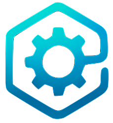

<h1> <span style="font-size: 1.5em;">AutomatosX</span></h1>

*The Invisible Power Addon for Vibe Coding CLI*

**AutomatosX transforms your AI coding assistant into a multi-agent enterprise platform** - with 10 specialized agents, persistent memory, and 80% cost savings through intelligent multi-provider routing. **You keep using Claude Code or Codex exactly as before**, but now with superpowers.


[](https://npm-stat.com/charts.html?package=%40defai.digital%2Fautomatox)
[](#)
[](https://www.apple.com/macos)
[](https://www.microsoft.com/windows)
[](https://ubuntu.com)
[](https://nodejs.org/)
[](LICENSE)

**Status**: ✅ **Production Ready** | v12.8.7 | Integration Module ESLint/TypeScript Fixes

**History**: See the [Project History](docs/contributing/project-history.md) for a concise timeline from the Tokyo AI Expo origins through v12.x.

> 🎯 **What AutomatosX Does**: Adds 10 specialized agents, persistent memory, workflow automation, and 80% cost savings to Claude Code/Codex - **without changing how you work**.

> 💡 **No Learning Curve**: Keep using Claude Code naturally. AutomatosX runs invisibly in the background, giving you enterprise capabilities automatically.

---

## ⚡ The Problem (Before AutomatosX)

**Claude Code is amazing, but...**

```
❌ Expensive: $150-300/mo API costs for heavy users
❌ No Memory: Loses context between sessions (wasted tokens)
❌ Single Agent: No specialized experts (backend, security, etc.)
❌ No Multi-Provider: Locked into one provider (no cost optimization)
❌ No Observability: Can't track what AI is doing (compliance issue)
❌ No Workflows: Manual coordination for complex tasks
```

**Total Monthly Cost**: $170-320/mo (Claude Pro + API usage)

---

## ✨ The Solution (After AutomatosX)

**Same Claude Code experience, but with superpowers:**

```
✅ 80% Cost Savings: $60/mo total (multi-provider routing)
✅ Perfect Memory: Remembers everything forever (SQLite FTS5)
✅ 10 Specialized Agents: Backend, security, DevOps experts
✅ Multi-Provider: Auto-routes to Claude/Gemini/OpenAI optimally
✅ Complete Observability: JSONL trace logs for every decision
✅ Workflow Automation: YAML specs for complex multi-step tasks
✅ Autonomous Bug Fixing: Detect and fix timer leaks, resource issues (v12.6.0)
✅ Autonomous Refactoring: Improve code quality with safety guards (v12.7.0)
✅ AST-Based Detection: Reduced false positives via TypeScript AST analysis (v12.8.0)
```

**Total Monthly Cost**: $60/mo (same unlimited usage)

**💰 Savings**: $110-260/mo per developer | $1,320-3,120/year per developer

---

## 🎨 How It Works (The Magic)

```
┌────────────────────────────────────────────────────────────────┐
│                    You (Developer)                              │
│        "Build user authentication with security audit"          │
└────────────────────────────────────────────────────────────────┘
                              ↓
                      [Claude Code]
                   (Your familiar interface)
                              ↓
┌────────────────────────────────────────────────────────────────┐
│                       AutomatosX                                │
│              (Invisible Power Layer)                            │
│                                                                  │
│  • Routes to optimal provider (cost + performance)              │
│  • Delegates to specialized agents (backend → security)         │
│  • Saves everything to persistent memory (zero repetition)      │
│  • Logs all decisions (complete observability)                  │
└────────────────────────────────────────────────────────────────┘
                              ↓
        ┌─────────────────────┼─────────────────────┐
        ↓                     ↓                     ↓
  ┌──────────┐          ┌──────────┐          ┌──────────┐
  │  Claude  │          │  Gemini  │          │ OpenAI   │
  │ (Reason) │          │  (Code)  │          │  (Speed) │
  └──────────┘          └──────────┘          └──────────┘
        ↓                     ↓                     ↓
                      [MCP Servers]
              Filesystem • Git • Database
```

**You**: Talk to Claude Code naturally (no new commands!)

**AutomatosX**: Invisibly orchestrates multi-agent execution, optimizes costs, saves to memory

**You Get**: Better results, 80% lower costs, perfect context - automatically

---

## 🚀 Quick Start (60 Seconds)

### Step 1: Install AutomatosX

```bash
npm install -g @defai.digital/automatosx
```

### Step 2: Initialize in Your Project

**Option A: With Claude Code Native Integration** (Recommended)

```bash
cd your-project
ax setup --claude-code
```

**What you get**:
- ✅ 18 slash commands (`/agent-backend`, `/agent-frontend`, etc.)
- ✅ Multi-agent orchestration (`/automatosx`)
- ✅ MCP server with 27 tools (including bugfix and refactor)
- ✅ Auto-generated manifests
- ✅ One-command diagnostics (`ax doctor --claude-code`)

**Option B: Invisible Mode** (Original)

```bash
cd your-project
ax setup
```

**What you get**:
- ✅ Invisible integration (no new commands)
- ✅ Automatic multi-agent delegation
- ✅ Persistent memory
- ✅ Cost optimization

**That's it!** AutomatosX is now running. Keep using Claude Code naturally.

### Step 3: Use Claude Code Naturally (No New Commands!)

**Just talk to Claude Code like you always do:**

```
"Build user authentication with JWT. Save the design to memory for future reference."
```

**Behind the scenes, AutomatosX automatically**:
- Routes to Gemini (cost-efficient for implementation)
- Delegates security audit to Claude (best reasoning)
- Saves everything to persistent memory (zero token waste)
- Logs all decisions (complete audit trail)

**You see**: Natural Claude Code response, but better and cheaper!

---

## 💬 Just Talk Naturally (Interactive Mode)

**Simply ask Claude Code to work with AutomatosX agents. No special commands needed.**

### 🐛 Find and Fix Bugs

```
"Please work with ax to find and fix bugs in src/core/"
```

AutomatosX automatically:
- Scans for timer leaks, resource issues, type errors
- Shows you what it found with severity levels
- Fixes auto-fixable bugs with verification
- Creates backups and rolls back if tests fail

### 📝 Review and Improve PRD

```
"Please review the PRD in docs/spec.md and discuss with ax agents to improve it"
```

AutomatosX automatically:
- Product agent analyzes requirements completeness
- Architecture agent identifies technical gaps
- Security agent flags compliance concerns
- Returns actionable suggestions for improvement

### 🔧 Refactor Code

```
"Please refactor the session manager using ax, focus on reducing complexity"
```

AutomatosX automatically:
- Measures current metrics (complexity, duplication)
- Identifies refactoring opportunities
- Applies changes with safety guards
- Verifies metrics improved (rollback if not)

### 🔒 Security Audit

```
"Ask the ax security agent to audit the authentication module"
```

AutomatosX automatically:
- Routes to Claude (best reasoning for security)
- Checks for OWASP vulnerabilities
- Reviews auth flow and token handling
- Saves findings to memory for future reference

### 💾 Remember Anything

```
"Save this API design to ax memory for later"
```

```
"What did we decide about the database schema last week?"
```

AutomatosX automatically:
- Stores context with full-text search (< 1ms)
- Retrieves relevant history when needed
- Zero token waste on repetition

---

> 📚 **Want CLI commands?** See [Full Documentation](docs/full-features.md) for `ax bugfix`, `ax refactor`, and all CLI options.

---

## 🎯 What You Get (Automatically)

### 1. 10 Specialized Agents

**No setup needed - just mention them in conversation:**

#### Core Agents (Recommended for Daily Use)

| Agent | Best For | Example Prompt |
|-------|----------|----------------|
| **backend** | API design, databases, server logic | "Design REST API for user authentication with JWT" |
| **frontend** | React components, UI/UX, accessibility | "Build responsive dashboard component with data grid" |
| **quality** | Testing, QA automation, code review | "Write unit tests for the payment module" |
| **architecture** | System design, scalability, tech decisions | "Design microservices architecture for order system" |
| **security** | Security audits, vulnerabilities, auth | "Audit this code for OWASP Top 10 vulnerabilities" |
| **devops** | CI/CD pipelines, Docker, infrastructure | "Create GitHub Actions workflow for deployment" |

#### Extended Agents (Specialized Workflows)

| Agent | Best For | Example Prompt |
|-------|----------|----------------|
| **data** | Data pipelines, ETL, analytics | "Build ETL pipeline for user analytics data" |
| **product** | Requirements, user stories, acceptance criteria | "Write user stories for checkout flow feature" |
| **writer** | Technical documentation, API docs, guides | "Write API documentation for the auth endpoints" |
| **design** | UX/UI design, wireframes, design systems | "Design user flow for onboarding experience" |

> **Tip**: Use `ax list agents --examples` to see all agents with usage examples.
> Use `ax list agents --all` to see specialty agents (ML, quantum, mobile, etc.)

**Example**:
```
"Security agent, please audit this authentication code."
"Backend agent, optimize this database query."
"DevOps agent, set up the CI/CD pipeline."
```

#### Quick Guide: Choosing the Right Agent

**Building something?**
- API/database work → `backend` (Bob)
- UI components → `frontend` (Frank)
- Mobile apps → `mobile` (Maya)
- Both together → Start with `backend`, then `frontend`

**Data & ML?**
- ML models, algorithms → `data-scientist` (Dana)
- Data pipelines, ETL → `data` (Daisy)

**Scientific & Research?**
- Quantum computing → `quantum-engineer` (Quinn)
- Space/aerospace → `aerospace-scientist` (Astrid)

**Reviewing code?**
- General review/tests → `quality` (Queenie)
- Security concerns → `security` (Steve)
- Architecture decisions → `architecture` (Avery)

**Setting up infrastructure?**
- CI/CD, Docker, deploy → `devops` (Oliver)

**Planning & docs?**
- Requirements/stories → `product` (Paris)
- Documentation → `writer` (Wendy)
- UX flows → `design` (Debbee)

**Not sure?** Just describe your task naturally - AutomatosX routes to the best agent automatically.

> **Learn more**: See [Agent Guide](docs/guides/agents.md) for detailed usage patterns and advanced workflows.

### 2. Persistent Memory (Context That Never Expires)

**Automatic - no configuration needed:**

- ✅ **< 1ms Search**: SQLite FTS5 full-text search
- ✅ **$0 Cost**: No embedding APIs (pure local)
- ✅ **100% Private**: Data never leaves your machine
- ✅ **Forever**: Infinite context window (not limited to session)
- ✅ **Smart**: Auto-injects relevant context from past conversations

**Example**:
```
Week 1: "Design microservices architecture"
       → Saved to memory automatically

Week 2: "Implement user service"
       → Memory auto-injects Week 1 architecture
       → Zero manual context passing
```

### 3. Multi-Provider Cost Optimization

**Intelligent routing - completely automatic:**

| Task Type | Routed To | Why | Cost |
|-----------|-----------|-----|------|
| Architecture design | Claude | Best reasoning | $20/mo unlimited |
| Code implementation | Gemini | Cost-efficient | $20/mo unlimited |
| Security audit | Claude | Critical accuracy | $20/mo unlimited |
| Test generation | Gemini | Fast & reliable | $20/mo unlimited |
| Quick questions | ChatGPT | Fastest response | $20/mo unlimited |

**Total**: $60/mo for unlimited usage across all providers

**vs API-only**: $150-300/mo with per-token billing

**Savings**: 80% monthly cost reduction

### 4. Complete Observability

**Automatic trace logging - no setup:**

- ✅ Who executed what task
- ✅ Which provider was used
- ✅ How much it cost (tokens)
- ✅ Delegation chains (agent → agent)
- ✅ Execution time and results

**Perfect for**: Compliance audits, debugging, optimization

### 5. Workflow Automation

**Define complex workflows once, reuse forever:**

```yaml
# .automatosx/workflows/release.ax.yaml
metadata:
  name: Production Release Workflow

steps:
  - Quality agent runs full test suite (Gemini - fast)
  - Security agent audits for vulnerabilities (Claude - thorough)
  - DevOps agent deploys to staging (Gemini - routine)
  - Product agent validates requirements (Claude - critical)
  - DevOps agent deploys to production (Gemini - routine)
```

**You say to Claude Code**:
```
"Run the production release workflow"
```

**AutomatosX executes everything automatically**, with optimal provider routing.

### 6. Autonomous Bug Fixing (v12.6.0)

**Just ask naturally:**
```
"Please work with ax to find and fix bugs in this project"
```

**What it detects**: Timer leaks, missing destroy(), promise leaks, event leaks, race conditions, memory leaks, uncaught promises, deprecated APIs, security issues, type errors (13 types total)

**Safety**: Backups created, typecheck verification, test verification, automatic rollback on failure

> 📚 **Full CLI reference**: See [Bugfix Documentation](docs/guides/bugfix.md) for `ax bugfix --dry-run`, `--staged`, `--json`, pre-commit hooks, and ignore comments

### 7. Autonomous Code Refactoring (v12.7.0)

**Just ask naturally:**
```
"Please refactor src/core/ using ax, focus on reducing complexity"
```

**What it improves**: Dead code removal, type safety (`any` types), complex conditionals, hardcoded values, naming, duplication, readability, performance

**Safety**: Metrics must improve or changes are rejected. Overengineering guards prevent unnecessary abstractions. Automatic rollback on failure.

> 📚 **Full CLI reference**: See [Refactor Documentation](docs/guides/refactor.md) for `ax refactor scan`, `--dry-run`, `--no-llm`, and all focus areas

---

## 💰 Cost Comparison (Real Numbers)

### Heavy User (100K tokens/day)

**Before AutomatosX** (Claude API only):
```
100K tokens/day × 30 days = 3M tokens/month
3M input × $3/1M = $9/mo
3M output × $15/1M = $45/mo
Claude Code Pro: $20/mo
Total: $74/mo (likely $150-300/mo in reality)
```

**After AutomatosX** (Multi-provider CLI):
```
Claude Code Pro: $20/mo (20% of tasks)
Gemini Advanced: $20/mo (70% of tasks)
ChatGPT Plus: $20/mo (10% of tasks)
Total: $60/mo (unlimited usage)

Savings: $90-240/mo (60-80% reduction)
```

### Team of 5 Developers

**Before**: 5 × $200/mo average = **$1,000/mo**

**After**: 5 × $60/mo = **$300/mo**

**Savings**: **$700/mo** | **$8,400/year**

### Enterprise (50 Developers)

**Before**: 50 × $200/mo = **$10,000/mo**

**After**: 50 × $60/mo + $500/mo Enterprise = **$3,500/mo**

**Savings**: **$6,500/mo** | **$78,000/year**

---

## 🏢 Enterprise Features (Invisible, Automatic)

### Offline-Friendly & Compliance-Ready

Unlike cloud-dependent tools, AutomatosX works in **air-gapped environments**:

- ✅ **100% Local**: All data stays on your machine
- ✅ **Offline Mode**: Works without internet (with Ollama)
- ✅ **Audit Trails**: Complete JSONL trace logging
- ✅ **Data Sovereignty**: No data leaves your infrastructure
- ✅ **GDPR/HIPAA Ready**: Built for regulated industries

**Perfect for**: Government, finance, healthcare

### Secure & Sandboxed

Enterprise security controls (automatic):

- ✅ **Filesystem Sandboxing**: Agents can't access outside project directory
- ✅ **Resource Limits**: CPU/memory caps per agent
- ✅ **Network Restrictions**: Control API access
- ✅ **Dangerous Operation Detection**: Auto-blocks risky commands
- ✅ **Audit Logging**: Every file access, API call logged

### Complete Observability

Transform AI agents into **governable workforce**:

- ✅ Real-time execution traces (JSONL)
- ✅ Token usage tracking (prevent budget overruns)
- ✅ Provider performance metrics
- ✅ Resource monitoring (CPU, memory)
- ✅ Delegation chains (full transparency)
- ✅ Cost attribution (per-agent, per-task)

---

## 📦 AutomatosX Editions

### Edition Positioning

**Pro** – For teams that want priority support & stable releases

**Enterprise** – For organizations needing compliance, control, and confidence at scale

---

### 🔷 AutomatosX Pro

**For startups, SMEs, and teams that want stability and support.**

#### Feature Highlights

**Core Platform**:
- ✅ **Priority email support & maintenance** - Dedicated support with SLA
- ✅ **Stable LTS releases** - Long-term support for production
- ✅ **Commercial use licensing** - Clear licensing for business use

**Advanced Workflows**:
- ✅ **Advanced workflow templates** - SaaS, RAG, API orchestration, CI/CD
- ✅ **Multi-project management** - Switch contexts, reuse workflows
- ✅ **Custom agent packs** - Team-specific expertise

**Provider & Configuration**:
- ✅ **Per-project provider profiles** - Different Claude/Gemini configs per project
- ✅ **Local memory encryption** - Secure persistent memory
- ✅ **Backup & restore** - Export/import workflows and memory

**Observability**:
- ✅ **Run history & usage dashboard** - Track execution history
- ✅ **MCP auto-install & hot-reload** - Automatic server management

**Perfect for**: Startups, consultancies, product teams

---

### 🏢 AutomatosX Enterprise

**For organizations where "Enterprises pay for compliance, convenience, and confidence - not just security."**

#### Compliance & Governance

**Audit & Control**:
- ✅ **Centralized control plane (self-hosted)** - Org-wide management
- ✅ **Org-wide workflow catalog with approvals** - Governed library
- ✅ **SSO (SAML/OIDC) & granular RBAC** - Enterprise auth
- ✅ **Audit-grade logs** - Complete trail of who ran what
- ✅ **Data retention & deletion policies** - Lifecycle management

**Data Protection**:
- ✅ **PII masking / DLP hooks** - Data loss prevention
- ✅ **Compliance-ready architecture** - GDPR, HIPAA, SOC2

#### Convenience & Control

**Infrastructure Management**:
- ✅ **Multi-node agent management** - Manage across dev/CI/prod
- ✅ **Central provider routing & failover** - Org-wide policies
- ✅ **Quota & rate limits** - Control usage by team/project
- ✅ **Central MCP registry** - Health monitoring, versioning

**Observability at Scale**:
- ✅ **Org dashboards** - Real-time visibility (runs, success, latency, tokens)
- ✅ **OpenTelemetry / SIEM integration** - Prometheus, Splunk, Datadog
- ✅ **Advanced analytics** - Cost attribution, performance trends

#### Confidence & Support

**Enterprise Infrastructure**:
- ✅ **Hardened, self-hosted deployment** - Docker/Helm for air-gapped
- ✅ **HA / backup & disaster recovery** - Automated failover
- ✅ **Multi-region support** - Data sovereignty

**Premium Support**:
- ✅ **Enterprise SLA & named technical contact** - Guaranteed response times
- ✅ **Onboarding workshops & playbooks** - Expert guidance
- ✅ **Optional design partnership** - Influence roadmap

**Perfect for**: Regulated industries (finance, healthcare, government), enterprises with compliance requirements

---

### 🆚 Edition Comparison

| Feature | Open Source | Pro | Enterprise |
|---------|-------------|-----|------------|
| **Core Orchestration** | ✅ Full | ✅ Full | ✅ Full |
| **Multi-Provider Support** | ✅ Yes | ✅ Yes | ✅ Yes |
| **Persistent Memory** | ✅ Yes | ✅ Encrypted | ✅ Encrypted + DLP |
| **MCP Management** | ✅ Local | ✅ Auto-install | ✅ Central registry |
| **Support** | Community | Priority email | Enterprise SLA |
| **LTS Releases** | ❌ No | ✅ Yes | ✅ Yes + backports |
| **Multi-Project** | Manual | ✅ Managed | ✅ Org catalog |
| **Custom Agents** | DIY | ✅ Agent packs | ✅ Org library |
| **Observability** | Local logs | ✅ Dashboard | ✅ SIEM integration |
| **Deployment** | Local only | Local only | ✅ Self-hosted cluster |
| **SSO / RBAC** | ❌ No | ❌ No | ✅ Yes |
| **Audit Logs** | Basic | Basic | ✅ Compliance-grade |
| **Data Governance** | ❌ No | ❌ No | ✅ Full DLP + policies |
| **Pricing** | Free (OSS) | Contact sales | Contact sales |

---

### 📞 Get Started with Pro or Enterprise

**AutomatosX Pro**: Perfect for commercial teams needing stability and support
- Email: sales@defai.digital
- Subject: "AutomatosX Pro - Pricing Inquiry"

**AutomatosX Enterprise**: For organizations requiring compliance at scale
- Email: sales@defai.digital
- Subject: "AutomatosX Enterprise - Compliance Discussion"

**Questions about licensing?** See [COMMERCIAL-LICENSE.md](COMMERCIAL-LICENSE.md)

---

## 🏆 Why AutomatosX Wins

| Capability | AutomatosX | Claude Code | Gemini CLI | Cursor |
|------------|------------|-------------|------------|--------|
| **Role** | **Power addon** | AI assistant | AI assistant | AI editor |
| **Learning Curve** | **Zero** (use naturally) | Low | Low | Medium |
| **Multi-Provider** | ✅ Auto-routing | ⚠️ Claude only | ⚠️ Gemini only | ⚠️ Limited |
| **Cost Savings** | ✅ 80% via routing | ❌ Pay-as-you-go | ❌ Pay-as-you-go | ❌ Pay-as-you-go |
| **Persistent Memory** | ✅ Forever | ❌ Session-only | ❌ Session-only | ❌ Session-only |
| **Multi-Agent Teams** | ✅ 10 specialists | ❌ Single agent | ❌ Single agent | ❌ Single agent |
| **Workflow Automation** | ✅ YAML specs | ❌ | ❌ | ❌ |
| **Observability** | ✅ Complete traces | ⚠️ Basic | ⚠️ Basic | ⚠️ Basic |
| **Offline-Friendly** | ✅ 100% local | ⚠️ Hybrid | ⚠️ Hybrid | ⚠️ Cloud |
| **Compliance** | ✅ GDPR-ready | ❌ | ❌ | ❌ |

**Bottom Line**: AutomatosX is the **only power addon** that gives you enterprise capabilities **without changing your workflow**.

---

## 📚 Real-World Use Cases

### 1. Startup Reducing AI Costs by 80%

**Scenario**: Small team, limited budget

```
"Build user authentication with security audit and tests.
Use cost-efficient routing - this is a standard feature."
```

**What AutomatosX does**:
- Routes implementation to Gemini ($20/mo unlimited)
- Routes security audit to Claude (critical accuracy)
- Generates tests with Gemini (fast)
- Saves design to memory (zero token waste in future)

**Cost**: $40/mo total (Claude Pro + Gemini Advanced)
**vs API-only**: $200-300/mo
**Savings**: $160-260/mo (80% reduction)

### 2. Enterprise Ensuring Compliance

**Scenario**: Finance company with GDPR requirements

```
"Review this payment processing code for vulnerabilities.
Log everything for compliance audit."
```

**What AutomatosX does**:
- Executes entirely offline (no data leaves company)
- Generates complete JSONL audit trail
- Uses local models via Ollama (air-gapped)
- Saves to encrypted local memory

**Compliance**: ✅ GDPR-ready, complete audit trail
**Security**: ✅ Zero data exfiltration
**Cost**: ✅ No cloud API costs

### 3. Team Coordinating Multi-Agent Workflows

**Scenario**: 5 developers building microservices

```
"Product agent, design payment service.
Backend agent, implement it.
Security agent, audit it.
Quality agent, write tests.
Save everything to shared memory."
```

**What AutomatosX does**:
- Product → Backend → Security → Quality (automatic delegation)
- Routes to optimal providers (cost + performance)
- Shared memory across team (perfect context)
- Parallel execution (3-5x faster)

**Result**: 5x productivity, 80% cost savings, zero manual coordination

---

## 🎓 Documentation

### Getting Started (5 Minutes)
- **[Quick Start Guide](docs/getting-started/quickstart-3min.md)** - Get productive fast
- [Installation](docs/getting-started/installation.md) - Detailed setup

### Natural Language Usage (Recommended)
- **[Using with Claude Code](docs/guides/claude-code-integration.md)** - Best practices
- [Using with Codex CLI](docs/guides/codex-integration.md) - Natural language examples
- [Agent Collaboration](docs/guides/agent-communication.md) - Multi-agent workflows

### Advanced Features
- [Cost Optimization Strategies](docs/advanced/cost-optimization.md) - Save 80%
- [Persistent Memory Guide](docs/guides/memory.md) - Context management
- [Workflow Automation](docs/guides/spec-kit-guide.md) - YAML workflows
- [Observability](docs/advanced/observability.md) - Trace logging
- [Autonomous Bug Fixing](docs/guides/bugfix.md) - Detect and fix bugs automatically
- [Autonomous Refactoring](docs/guides/refactor.md) - Improve code quality with safety guards

### For Advanced Users (5% Who Need CLI)
- **[Full Features List](docs/full-features.md)** - All CLI commands and capabilities
- [CLI Command Reference](docs/reference/cli-commands.md) - Complete CLI docs
- [API Reference](docs/reference/api.md) - Programmatic usage

### Enterprise
- [Security & Compliance](docs/advanced/security.md) - GDPR, HIPAA, SOC2
- [Offline Deployment](docs/advanced/offline-deployment.md) - Air-gapped environments
- [Multi-Region Setup](docs/advanced/multi-region.md) - Data sovereignty

---

## 💻 Installation

### NPM (Recommended)

```bash
npm install -g @defai.digital/automatosx
ax --version  # v12.7.0
```

### Initialize Your Project

```bash
cd your-project
ax setup
```

**What `ax setup` does:**
- ✅ Creates `.automatosx/` directory
- ✅ Installs 10 specialized agents (6 core + 4 extended)
- ✅ Generates optimal configuration
- ✅ Initializes persistent memory database
- ✅ Sets up trace logging

**That's it!** Now just use Claude Code/Codex naturally - AutomatosX runs invisibly.

### Requirements

- **Node.js**: >= 24.0.0
- **At least one AI CLI** (you probably already have):
  - [Claude Code](https://claude.ai/code) - **Recommended** (best reasoning)
  - [Gemini CLI](https://ai.google.dev/gemini-api/docs/cli) - Cost-efficient
  - [Codex CLI](https://developers.openai.com/codex/cli/) - Fastest

**Optional**:
- [ax-cli](.ax-cli/README.md) - GLM-first native CLI for Chinese models

---

## 🚦 Production Readiness

✅ **v12.7.0 Released** - Cognitive Prompt Engineering Framework + Autonomous Refactoring
✅ **8,110+ Tests Passing** - Comprehensive coverage
✅ **TypeScript Strict Mode** - Type-safe codebase
✅ **Zero Resource Leaks** - Clean shutdown guaranteed
✅ **Cross-Platform** - macOS, Windows, Ubuntu
✅ **100% Local-First** - No cloud dependencies
✅ **Enterprise-Ready** - Observability, governance, compliance

---

## 🤝 Contributing

We welcome contributions! See [CONTRIBUTING.md](CONTRIBUTING.md)

### Development Setup

```bash
git clone https://github.com/defai-digital/automatosx.git
cd automatosx
npm install
npm test
```

---

## 📦 Editions & Licensing

AutomatosX uses an **open-core model** with three editions:

| Edition | License | Price | Best For |
|---------|---------|-------|----------|
| **Open Source** | Apache 2.0 | Free Forever | Everyone (individuals, startups, enterprises) |
| **Pro** | Commercial EULA | Contact Sales | Teams needing priority support + LTS |
| **Enterprise** | Enterprise Agreement | Contact Sales | Regulated industries + compliance needs |

### Open Source Edition (This Repo)

**License**: [Apache License 2.0](LICENSE) - Free forever, no revenue limits

**What's Included**:
- ✅ Full source code on GitHub
- ✅ Core orchestration engine + 10 AI agents (6 core + 4 extended)
- ✅ Persistent memory system (SQLite FTS5)
- ✅ Multi-provider routing (Claude, Gemini, Codex CLI)
- ✅ Workflow specs and execution
- ✅ Community support (GitHub Issues)

**Who Can Use**: Anyone, for any purpose (personal, commercial, research)

### Pro & Enterprise Editions

**Additional Features**: Advanced workflows, team collaboration, premium agent packs, SSO/RBAC, audit logging, self-hosted deployment, white-label options, priority support (1-day SLA), long-term support (LTS), custom SLA (24/7 available)

**Get Started**: Contact <sales@defai.digital> for pricing

**Learn More**: See [COMMERCIAL-LICENSE.md](COMMERCIAL-LICENSE.md) for detailed edition comparison

---

**Copyright 2025 DEFAI Private Limited**

**Note**: We removed revenue thresholds ($2M limit) and OpenRAIL-M references in v3.0 (November 2025). Open Source Edition is now truly free for everyone - no limits, no tracking. If you need extra features or guaranteed support, explore Pro/Enterprise editions.

---

## 🌟 Star Us on GitHub

If AutomatosX saves you 80% on AI costs **without changing your workflow**, give us a star! ⭐

[⭐ Star on GitHub](https://github.com/defai-digital/automatosx)

---

## 📧 Support

- **Issues**: [GitHub Issues](https://github.com/defai-digital/automatosx/issues)
- **Email**: <support@defai.digital>
- **Commercial Licenses**: <sales@defai.digital>

---

<p align="center">
  Made with ❤️ by <a href="https://defai.digital">DEFAI Digital</a>
</p>
