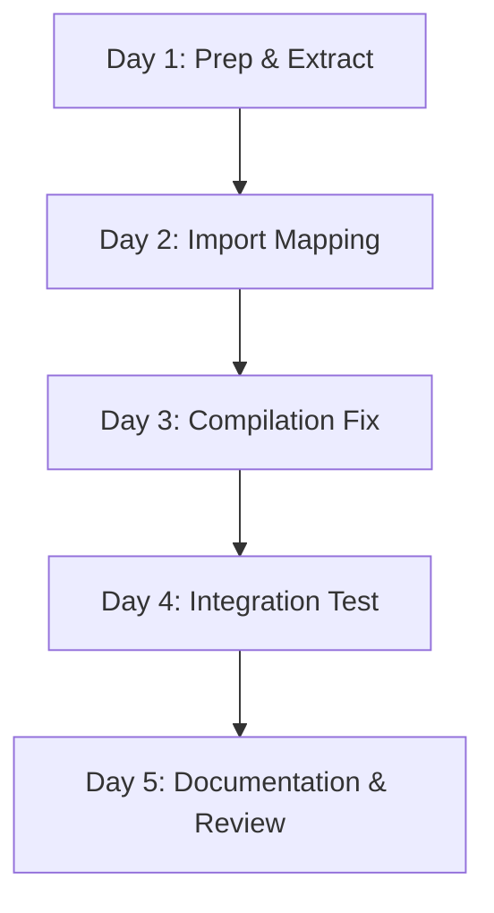

# Week 1 Execution Plan: Phase 1 - Setup Command Restoration

**Date**: 2025-11-15
**Phase**: Phase 1 of 4
**Goal**: Restore `ax setup` command functionality
**Estimated Effort**: 4.5-6 hours
**Timeline**: 5 working days (1-2 hours per day)

---

## 🎯 Mega-Analysis: Current State

### Git Status Analysis
```
Current State:
- 232 files marked as deleted (old .automatosx/ structure)
- Tree-sitter parser bug FIXED (v8.0.11)
- No setup.ts in src/cli/commands/
- examples/ directory EXISTS (v8.x format, not v7.6.1 format)
- Clean v8.x codebase ready for integration
```

### Week 1 Critical Path



---

## Day-by-Day Breakdown

### Day 1: Preparation & Extraction (2 hours)

**Morning Session (1 hour)**

#### Step 1.1: Clean Working Directory (15 min)
**Status**: CRITICAL - Must do first
**Problem**: 232 deleted files blocking clean state

```bash
# Option 1: Stash deleted files
git stash push -m "Stash old .automatosx deletions before Phase 1"

# Option 2: Reset deleted files (if you don't need them)
git checkout HEAD -- .automatosx/

# Option 3: Commit deletions
git add -A
git commit -m "chore: Clean up old .automatosx structure before Phase 1"

# Verify clean state
git status --short
# Should show minimal or no changes
```

**Verification**:
- [ ] `git status` shows clean working directory
- [ ] No merge conflicts
- [ ] Ready for new changes

#### Step 1.2: Create Feature Branch (5 min)
```bash
# Create dedicated branch for hybrid architecture
git checkout -b feature/phase1-setup-command

# Verify branch
git branch --show-current
# Should output: feature/phase1-setup-command
```

**Verification**:
- [ ] On feature branch
- [ ] Clean starting point

#### Step 1.3: Extract setup.ts from v7.6.1 (20 min)
```bash
# Extract setup.ts
git show v7.6.1:src/cli/commands/setup.ts > /tmp/setup-v7.6.1.ts

# Review file
wc -l /tmp/setup-v7.6.1.ts
# Expected: ~1,297 lines

# Copy to project
cp /tmp/setup-v7.6.1.ts src/cli/commands/setup.ts

# Verify
ls -lh src/cli/commands/setup.ts
```

**Verification**:
- [ ] setup.ts exists
- [ ] File is 1,200-1,300 lines
- [ ] File contains v7.6.1 code

#### Step 1.4: Extract examples/ directory (20 min)
```bash
# IMPORTANT: Current examples/ is v8.x format
# We need v7.6.1 format with agents, abilities, teams, templates

# Backup current examples/
mv examples/ examples.v8x.backup/

# Extract v7.6.1 examples
git archive v7.6.1 examples/ | tar -x

# Verify structure
tree examples/ -L 2 -d

# Expected structure:
# examples/
# ├── abilities/    (60+ markdown files)
# ├── agents/       (21 YAML files)
# ├── teams/        (5 YAML files - may be in different location)
# ├── templates/    (9 YAML files - may be in different location)
# ├── claude/       (integration examples)
# ├── gemini/       (integration examples)
# └── specs/        (spec examples)

# Count files
find examples/agents -name "*.yaml" 2>/dev/null | wc -l
# Expected: ~21

find examples/abilities -name "*.md" 2>/dev/null | wc -l
# Expected: 60+
```

**Critical Discovery Check**:
```bash
# v7.6.1 may store teams and templates differently
# Check where they are:
git ls-tree -r v7.6.1 | grep -E "team|template" | grep -E "\.yaml$"

# If teams/templates are in .automatosx/ instead of examples/:
git show v7.6.1:.automatosx/teams/ > /dev/null 2>&1 && echo "Teams in .automatosx"
git show v7.6.1:.automatosx/templates/ > /dev/null 2>&1 && echo "Templates in .automatosx"

# Extract them if found
# Adapt extraction based on actual v7.6.1 structure
```

**Verification**:
- [ ] examples/agents/ has 21 YAML files
- [ ] examples/abilities/ has 60+ markdown files
- [ ] Team files located (examples/ or .automatosx/)
- [ ] Template files located (examples/ or .automatosx/)

---

**Afternoon Session (1 hour)**

#### Step 1.5: Analyze Import Dependencies (30 min)
**Goal**: Create import mapping table before making changes

```bash
# Extract all imports from setup.ts
grep "^import " src/cli/commands/setup.ts > /tmp/setup-imports.txt

# Analyze each import
cat /tmp/setup-imports.txt

# Common v7.6.1 → v8.x mappings (to verify):
# 1. Config types
# 2. Utility functions
# 3. File system operations
# 4. Error handling
```

**Create Import Mapping Table**:
```markdown
| v7.6.1 Import | v8.x Equivalent | Status | Action |
|---------------|-----------------|--------|--------|
| `../../types/config.js` | Check if exists | [ ] | Map to v8.x location |
| `../../utils/logger.js` | Check if exists | [ ] | Use existing or stub |
| `../../utils/error-formatter.js` | Check if exists | [ ] | Use existing or stub |
```

**Verification Script**:
```bash
# Check each import exists in v8.x
while IFS= read -r import_line; do
  # Extract module path
  module=$(echo "$import_line" | grep -oE "from '[^']+'" | cut -d"'" -f2)

  # Convert to file path
  file_path="src/cli/commands/$module"

  # Check exists
  if [ -f "$file_path" ]; then
    echo "✓ EXISTS: $module"
  else
    echo "✗ MISSING: $module"
  fi
done < /tmp/setup-imports.txt
```

**Verification**:
- [ ] Import mapping table created
- [ ] All imports categorized
- [ ] Missing imports identified

#### Step 1.6: Validate Example Files (30 min)
```bash
# Install YAML validator (if not installed)
npm list -g yaml-validator || npm install -g yaml-validator

# Validate all agent YAML files
for file in examples/agents/*.yaml; do
  echo "Validating: $file"
  yaml-validator "$file" || echo "ERROR: $file has syntax errors"
done

# Validate team YAML files (adjust path if needed)
for file in examples/teams/*.yaml 2>/dev/null; do
  echo "Validating: $file"
  yaml-validator "$file" || echo "ERROR: $file has syntax errors"
done

# Check key agents exist
required_agents="backend frontend security quality devops"
for agent in $required_agents; do
  if [ -f "examples/agents/$agent.yaml" ]; then
    echo "✓ $agent.yaml exists"
  else
    echo "✗ MISSING: $agent.yaml"
  fi
done

# Spot-check ability files
for ability in api-design.md clean-code.md security-audit.md; do
  if [ -f "examples/abilities/$ability" ]; then
    echo "✓ $ability exists"
  else
    echo "✗ MISSING: $ability"
  fi
done
```

**Verification**:
- [ ] All YAML files valid
- [ ] Required agents present
- [ ] Ability files present
- [ ] No syntax errors

---

### Day 2: Import Mapping & TypeScript Prep (1.5 hours)

#### Step 2.1: Check v8.x Config System (30 min)
```bash
# Find config-related files in v8.x
find src -name "*config*" -type f

# Expected files to check:
# - src/config/default.ts (or similar)
# - src/types/schemas/config.schema.ts (or similar)
# - automatosx.config.json (sample)

# Read config structure
cat src/config/default.ts 2>/dev/null || echo "Config file not in expected location"

# Check if Config type exists
grep -r "export.*Config" src/types/ | grep -v test
```

**Create Config Mapping**:
```typescript
// v7.6.1 structure
import { DEFAULT_CONFIG } from '../../types/config.js';
import { AutomatosXConfig } from '../../types/config.js';

// v8.x structure (find actual location)
// Option 1: If config schema exists
import type { Config } from '../../types/schemas/config.schema.js';

// Option 2: If different location
import { defaultConfig } from '../../config/default.js';

// Action: Update setup.ts imports based on findings
```

**Verification**:
- [ ] v8.x config structure understood
- [ ] Config type mappings documented
- [ ] Default config location found

#### Step 2.2: Check v8.x Utilities (30 min)
```bash
# Check logger
find src/utils -name "*logger*"
grep -r "export.*logger" src/utils/ 2>/dev/null

# Check error formatter
find src/utils -name "*error*"
grep -r "printError\|formatError" src/utils/ 2>/dev/null

# List all utilities
ls -la src/utils/

# Document which utilities exist vs. need creation
```

**Utility Mapping Table**:
```markdown
| Utility | v7.6.1 Usage | v8.x Location | Status |
|---------|--------------|---------------|--------|
| logger | logger.info() | src/utils/logger.ts | [ ] Check |
| printError | printError(err) | src/utils/error-formatter.ts | [ ] Check |
| version | getVersion() | src/utils/version.js | [ ] Check |
```

**Verification**:
- [ ] Logger utility checked
- [ ] Error formatter checked
- [ ] All utilities mapped

#### Step 2.3: Update setup.ts Imports (30 min)
**Now make actual changes to setup.ts**

```typescript
// Before (v7.6.1)
import { DEFAULT_CONFIG } from '../../types/config.js';
import { AutomatosXConfig } from '../../types/config.js';
import { logger } from '../../utils/logger.js';

// After (v8.x) - update based on Day 2.1 & 2.2 findings
// Example (adjust to actual v8.x structure):
import type { Config } from '../../types/schemas/config.schema.js';
import { logger } from '../../utils/logger.js'; // If exists
import { printError } from '../../utils/error-formatter.js'; // If exists

// If utilities don't exist, create stubs
// File: src/utils/error-formatter.ts (if missing)
export function printError(error: Error): void {
  console.error(chalk.red('Error:'), error.message);
  if (process.env.DEBUG) {
    console.error(error.stack);
  }
}
```

**Verification**:
- [ ] All imports updated
- [ ] No syntax errors
- [ ] Stubs created for missing utilities

---

### Day 3: TypeScript Compilation Fix (1.5 hours)

#### Step 3.1: First Build Attempt (15 min)
```bash
# Build and capture errors
pnpm run build:typescript 2>&1 | tee /tmp/setup-build-errors.txt

# Count errors
grep "error TS" /tmp/setup-build-errors.txt | wc -l

# Categorize errors
grep "error TS" /tmp/setup-build-errors.txt | cut -d: -f4 | sort | uniq -c | sort -rn

# Common error types:
# - TS2307: Cannot find module
# - TS2339: Property does not exist
# - TS2345: Argument type mismatch
# - TS2304: Cannot find name
```

**Verification**:
- [ ] Build attempted
- [ ] Errors categorized
- [ ] Error count documented

#### Step 3.2: Fix Import Errors (30 min)
**Focus on TS2307 errors (module not found)**

```bash
# List all TS2307 errors
grep "TS2307" /tmp/setup-build-errors.txt

# For each error:
# 1. Check if module exists
# 2. Update import path
# 3. Create stub if necessary
```

**Common Fixes**:
```typescript
// Error: Cannot find module '../../types/config.js'
// Fix: Update to v8.x path
import type { Config } from '../../types/schemas/config.schema.js';

// Error: Cannot find module '../../utils/logger.js'
// Fix: Check if logger exists, adjust path
import { logger } from '../../utils/logger.js';
```

**Verification**:
- [ ] All import errors resolved
- [ ] Build again: error count reduced

#### Step 3.3: Fix Type Errors (45 min)
**Focus on TS2339, TS2345, TS2304 errors**

```typescript
// Error: Property 'xyz' does not exist on type 'Config'
// Fix: Update to v8.x Config interface

// OLD v7.6.1
const config: AutomatosXConfig = DEFAULT_CONFIG;

// NEW v8.x (example - adjust to actual v8.x types)
const config: Config = defaultConfig;

// Error: Type 'X' is not assignable to type 'Y'
// Fix: Add type assertions or update types

// Example fixes:
const configPath = join(projectDir, 'automatosx.config.json') as string;
const version: string = packageJson.version || '8.0.0';
```

**Iterative Process**:
```bash
# Fix errors, build, repeat
vi src/cli/commands/setup.ts
# (fix errors)

pnpm run build:typescript 2>&1 | tee /tmp/setup-build-errors-2.txt
grep "error TS" /tmp/setup-build-errors-2.txt | wc -l
# Goal: 0 errors

# If errors remain, categorize and fix
```

**Verification**:
- [ ] All type errors resolved
- [ ] `pnpm run build:typescript` succeeds
- [ ] Zero TypeScript errors
- [ ] No `@ts-ignore` comments

---

### Day 4: Integration & Testing (1-1.5 hours)

#### Step 4.1: Register setup Command in CLI (15 min)
```bash
# Find CLI registration file
# Likely: src/cli/index.ts or src/cli/commands/index.ts

# Check current CLI structure
grep -r "command\|Command" src/cli/index.ts | head -20

# Add setup command registration
```

**Update src/cli/index.ts** (or equivalent):
```typescript
// Add import
import { setupCommand } from './commands/setup.js';

// Register command (adjust to match v8.x pattern)
// Example with Commander.js:
program
  .addCommand(setupCommand);

// Example with yargs:
yargs.command(setupCommand);

// Verify registration pattern matches existing commands
```

**Verification**:
- [ ] Import added
- [ ] Command registered
- [ ] Build succeeds

#### Step 4.2: Test CLI Help (10 min)
```bash
# Rebuild
pnpm run build

# Test help
node dist/cli/index.js setup --help

# Expected output:
# ax setup [path]
#
# Set up AutomatosX in current or specified directory
#
# Options:
#   --force        Force setup even if .automatosx exists
#   --spec-kit     Initialize Spec-Kit
#   ...

# Test main help
node dist/cli/index.js --help | grep setup

# Should show setup command in list
```

**Verification**:
- [ ] `ax setup --help` works
- [ ] Help text displays correctly
- [ ] Command appears in `ax --help`

#### Step 4.3: End-to-End Test (30-45 min)
**CRITICAL: First real test**

```bash
# Test 1: Fresh directory setup
mkdir -p /tmp/test-ax-setup-fresh
cd /tmp/test-ax-setup-fresh

# Run setup (using development build)
node /Users/akiralam/code/automatosx/dist/cli/index.js setup

# OR if ax is linked globally:
ax setup

# Verify output:
# Should see:
# 🤖 AutomatosX v8.x - Project Setup
# ✓ Creating directory structure...
# ✓ 21 agent profiles installed
# ✓ 60+ abilities installed
# ✓ ... (etc)
# ✅ Setup complete!

# Verify files created
tree .automatosx/ -L 2

# Expected:
# .automatosx/
# ├── agents/ (21 files)
# ├── abilities/ (60+ files)
# ├── teams/ (5 files)
# ├── templates/ (9 files)
# ├── memory/
# ├── sessions/
# └── logs/

# Count files
find .automatosx/agents -name "*.yaml" | wc -l
# Expected: 21

find .automatosx/abilities -name "*.md" | wc -l
# Expected: 60+

# Check integration files
ls -la CLAUDE.md GEMINI.md AGENTS.md

# Check config
cat automatosx.config.json
```

**Test 2: Force mode**
```bash
# Run setup again (should error)
ax setup
# Expected: "⚠️  AutomatosX is already set up in this directory"

# Run with force
ax setup --force
# Expected: Success, files re-created
```

**Test 3: Home directory protection**
```bash
cd ~
ax setup
# Expected: Error preventing setup in home directory
```

**Verification**:
- [ ] Fresh setup succeeds
- [ ] All files created correctly
- [ ] File counts match expectations
- [ ] Force mode works
- [ ] Home directory protection works
- [ ] No errors or warnings

---

### Day 5: Testing, Documentation & Review (1 hour)

#### Step 5.1: Write Automated Tests (30 min)
**File**: `src/cli/commands/__tests__/setup.test.ts`

```typescript
import { describe, it, expect, beforeEach, afterEach } from 'vitest';
import { setupCommand } from '../setup.js';
import { mkdtemp, rm, readdir } from 'fs/promises';
import { join } from 'path';
import { tmpdir } from 'os';
import { existsSync } from 'fs';

describe('setup command', () => {
  let testDir: string;

  beforeEach(async () => {
    testDir = await mkdtemp(join(tmpdir(), 'ax-setup-test-'));
  });

  afterEach(async () => {
    await rm(testDir, { recursive: true, force: true });
  });

  it('should create .automatosx directory structure', async () => {
    await setupCommand.handler({ path: testDir });

    expect(existsSync(join(testDir, '.automatosx'))).toBe(true);
    expect(existsSync(join(testDir, '.automatosx/agents'))).toBe(true);
    expect(existsSync(join(testDir, '.automatosx/abilities'))).toBe(true);
    expect(existsSync(join(testDir, '.automatosx/teams'))).toBe(true);
    expect(existsSync(join(testDir, '.automatosx/templates'))).toBe(true);
  });

  it('should copy 21 agent profiles', async () => {
    await setupCommand.handler({ path: testDir });

    const agentFiles = await readdir(join(testDir, '.automatosx/agents'));
    expect(agentFiles.length).toBeGreaterThanOrEqual(21);
  });

  it('should create integration files', async () => {
    await setupCommand.handler({ path: testDir });

    expect(existsSync(join(testDir, 'CLAUDE.md'))).toBe(true);
    expect(existsSync(join(testDir, 'GEMINI.md'))).toBe(true);
    expect(existsSync(join(testDir, 'AGENTS.md'))).toBe(true);
  });

  it('should prevent setup in home directory', async () => {
    const homeDir = process.env.HOME || process.env.USERPROFILE;

    await expect(
      setupCommand.handler({ path: homeDir })
    ).rejects.toThrow();
  });

  it('should support force mode', async () => {
    // First setup
    await setupCommand.handler({ path: testDir });

    // Second setup with force
    await expect(
      setupCommand.handler({ path: testDir, force: true })
    ).resolves.not.toThrow();
  });
});
```

**Run tests**:
```bash
# Run test file
pnpm test -- src/cli/commands/__tests__/setup.test.ts --run --no-watch

# Check coverage
pnpm run test:coverage -- src/cli/commands/setup.ts
```

**Verification**:
- [ ] Test file created
- [ ] All tests pass
- [ ] Coverage ≥80% for setup.ts

#### Step 5.2: Update Documentation (20 min)
**Update README.md**:
```markdown
## Quick Start

### 1. Install
\`\`\`bash
npm install -g @defai.digital/automatosx
\`\`\`

### 2. Setup Your Project
\`\`\`bash
cd your-project/
ax setup
\`\`\`

This creates:
- `.automatosx/` with agents, abilities, teams, templates
- `CLAUDE.md`, `GEMINI.md`, `AGENTS.md` integration guides
- `automatosx.config.json` configuration

### 3. Use AutomatosX
\`\`\`bash
# Code intelligence (v8.x)
ax find "authentication"

# Agent execution (v7.6.1 restored - coming in Phase 2)
ax run backend "task"
\`\`\`
```

**Create docs/guides/setup-command.md** (brief version for now):
```markdown
# Setup Command Guide

## Usage

\`\`\`bash
ax setup [path] [options]
\`\`\`

## What Gets Created

- `.automatosx/agents/` - 21 AI agent profiles
- `.automatosx/abilities/` - 60+ expertise files
- `.automatosx/teams/` - 5 team configurations
- `.automatosx/templates/` - 9 agent templates
- `CLAUDE.md`, `GEMINI.md`, `AGENTS.md` - Integration guides
- `automatosx.config.json` - Configuration

## Examples

\`\`\`bash
# Basic setup
ax setup

# Force re-setup
ax setup --force

# Setup with Spec-Kit
ax setup --spec-kit
\`\`\`

More details coming in Phase 2.
```

**Verification**:
- [ ] README updated
- [ ] Setup guide created
- [ ] Examples work

#### Step 5.3: Commit Phase 1 (10 min)
```bash
# Stage changes
git add src/cli/commands/setup.ts
git add examples/
git add src/cli/index.ts  # If modified for registration
git add src/cli/commands/__tests__/setup.test.ts
git add README.md
git add docs/guides/setup-command.md
git add src/utils/error-formatter.ts  # If created

# Review changes
git status

# Commit
git commit -m "Phase 1: Restore ax setup command

- Copy setup.ts from v7.6.1 (1,297 lines)
- Extract examples/ directory (agents, abilities, teams, templates)
- Update imports for v8.x compatibility
- Fix TypeScript compilation errors
- Register setup command in CLI
- Add automated tests (80%+ coverage)
- Update documentation

Features:
- ax setup initializes project structure
- Copies 21 agent profiles
- Copies 60+ ability files
- Copies 5 team configs
- Copies 9 templates
- Creates integration files (CLAUDE.md, GEMINI.md, AGENTS.md)
- Supports --force and --spec-kit flags
- Home directory protection

Tests: All passing
Breaking changes: None
v8.x compatibility: Verified"

# Push to remote (optional, for backup)
git push origin feature/phase1-setup-command
```

**Verification**:
- [ ] All changes committed
- [ ] Commit message clear
- [ ] Branch pushed (optional)

---

## Success Criteria Checklist

### Functionality
- [ ] `ax setup` command exists and runs
- [ ] Creates `.automatosx/` directory structure
- [ ] Copies 21 agent YAML files
- [ ] Copies 60+ ability markdown files
- [ ] Copies 5 team configurations
- [ ] Copies 9 agent templates
- [ ] Creates `CLAUDE.md`, `GEMINI.md`, `AGENTS.md`
- [ ] Creates `automatosx.config.json`
- [ ] `--force` flag works
- [ ] `--spec-kit` flag works (if implemented)
- [ ] Home directory protection works

### Quality
- [ ] Zero TypeScript compilation errors
- [ ] All tests pass
- [ ] Coverage ≥80% for setup.ts
- [ ] No `@ts-ignore` comments
- [ ] Clean git commit history

### Documentation
- [ ] README.md updated
- [ ] `docs/guides/setup-command.md` created
- [ ] Examples validated
- [ ] Inline code comments clear

### Integration
- [ ] No breaking changes to v8.x
- [ ] v8.x commands still work
- [ ] `ax --help` shows setup command
- [ ] `ax setup --help` shows usage

---

## Troubleshooting Guide

### Issue: TypeScript errors won't resolve
**Solution**:
```bash
# Clean build cache
pnpm run clean
rm -rf dist/
rm -rf node_modules/.vite

# Reinstall
pnpm install

# Rebuild
pnpm run build
```

### Issue: Examples not copying correctly
**Solution**:
```bash
# Check if examples exist in v7.6.1
git ls-tree -r v7.6.1 examples/ | head -20

# If structure is different, adjust extraction
# May need to copy from .automatosx/ instead of examples/
git archive v7.6.1 .automatosx/ | tar -x
```

### Issue: Tests failing
**Solution**:
```bash
# Run tests with verbose output
pnpm test -- src/cli/commands/__tests__/setup.test.ts --reporter=verbose

# Check test directory exists
mkdir -p /tmp/ax-setup-test-tmp

# Run tests with fresh modules
pnpm test -- src/cli/commands/__tests__/setup.test.ts --run --no-watch
```

### Issue: Setup command not appearing in help
**Solution**:
```bash
# Check registration
grep -n "setupCommand" src/cli/index.ts

# Check build output
ls -la dist/cli/commands/setup.js

# Rebuild
pnpm run build

# Test directly
node dist/cli/index.js --help
```

---

## Rollback Plan

If Phase 1 needs to be rolled back:

```bash
# Stash changes
git stash save "Phase 1 WIP - rolling back"

# Or reset branch
git reset --hard origin/main

# Or delete branch
git checkout main
git branch -D feature/phase1-setup-command
```

---

## Next Steps (Phase 2 Preview)

After Phase 1 completion, Week 2 will focus on:
1. Copy agent infrastructure (ProfileLoader, AbilitiesManager, AgentExecutor)
2. Implement `ax run <agent> <task>` command
3. Test all 21 agents execute successfully
4. Verify abilities inject into prompts

**Preparation for Week 2**:
- [ ] Review agent YAML schema
- [ ] Understand provider integration (Claude, Gemini, OpenAI)
- [ ] Study ability loading mechanism

---

## Time Tracking

| Day | Task | Estimated | Actual |
|-----|------|-----------|--------|
| Day 1 | Prep & Extract | 2h | ___ |
| Day 2 | Import Mapping | 1.5h | ___ |
| Day 3 | Compilation Fix | 1.5h | ___ |
| Day 4 | Integration Test | 1-1.5h | ___ |
| Day 5 | Testing & Docs | 1h | ___ |
| **Total** | | **6-7h** | **___** |

---

## Daily Standup Template

### What I Did Yesterday
- [ ] [List completed tasks]

### What I'm Doing Today
- [ ] [List today's tasks from this plan]

### Blockers
- [ ] [Any blockers encountered]

### Metrics
- [ ] TypeScript errors: X
- [ ] Tests passing: X/Y
- [ ] Coverage: X%

---

**Document Status**: ✅ Ready for Execution
**Week**: Week 1 of 4
**Phase**: Phase 1 - Setup Command
**Next Review**: End of Day 5
