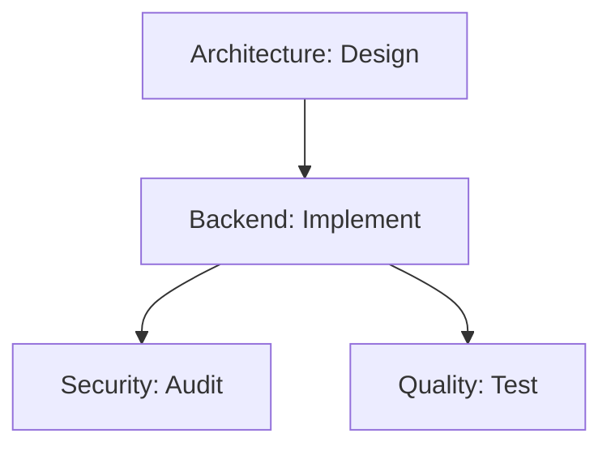

# Spec-Kit Usage Guide

## What is Spec-Kit?

Spec-Kit is AutomatosX's YAML-driven workflow generation system that enables declarative, reproducible, and cost-optimized AI agent workflows. Instead of running agents individually, you define entire projects as specifications that AutomatosX orchestrates automatically.

### Benefits

- **Declarative Workflows**: Define what you want, not how to get it
- **Dependency Management**: Automatic task ordering and parallel execution
- **Cost Optimization**: Policy-driven provider selection minimizes costs
- **Reproducibility**: Version-controlled specs ensure consistent results
- **Change Detection**: Smart hashing detects when plans need regeneration
- **Team Collaboration**: Share and collaborate on workflow definitions

### Use Cases

- Complex multi-step projects
- Team collaboration workflows
- Reproducible build pipelines
- Projects requiring specific cost/latency/privacy constraints
- Scaffolding and test generation

---

## Getting Started with Spec-Kit

### Creating Your First Spec

You can create specs in two ways:

#### Option 1: Natural Language Generation

```bash
ax spec create "Build authentication system with database, API, JWT, and tests"
```

AutomatosX will generate a complete spec YAML file with appropriate agents and dependencies.

#### Option 2: Manual YAML Creation

Create a file in `.automatosx/specs/auth-system.yaml`:

```yaml
metadata:
  name: auth-system
  version: 1.0.0
  description: Complete authentication system
  tags: [auth, api, security]

policy:
  goals: [cost, reliability]
  constraints:
    cost:
      maxPerRequest: 0.10
    latency:
      p95: 30000
    privacy:
      allowedClouds: [aws, gcp]

actors:
  design:
    agent: architecture
    task: Design authentication system architecture with database schema

  implement:
    agent: backend
    task: Implement authentication API with JWT tokens
    dependsOn: [design]

  secure:
    agent: security
    task: Audit authentication implementation for vulnerabilities
    dependsOn: [implement]

  test:
    agent: quality
    task: Write comprehensive tests for authentication system
    dependsOn: [implement]
```

---

## Spec Components Explained

### 1. Metadata

```yaml
metadata:
  name: my-project          # Unique identifier
  version: 1.0.0            # Semantic versioning
  description: Description  # Human-readable summary
  tags: [tag1, tag2]        # Categorization tags
```

### 2. Policy

Define how providers should be selected:

#### Goals
- `cost`: Minimize cost (prioritize free tiers, cheaper providers)
- `latency`: Minimize response time (prioritize faster providers)
- `reliability`: Maximize uptime (prioritize stable providers)
- `balanced`: Balance all factors

#### Constraints

```yaml
policy:
  goals: [cost, reliability]
  constraints:
    cost:
      maxPerRequest: 0.10    # Max cost per single request
      maxPerDay: 5.00        # Max daily cost budget
    latency:
      p95: 30000             # 95th percentile latency in ms
      max: 60000             # Maximum acceptable latency
    privacy:
      allowedClouds: [aws, gcp]      # Allowed cloud providers
      allowedRegions: [us-east-1]    # Allowed regions
      dataRetention: 30               # Data retention in days
```

### 3. Actors

Define which agents perform which tasks:

```yaml
actors:
  task-id:
    agent: agent-name       # Agent to execute task
    task: task description  # What the agent should do
    dependsOn: [other-task] # Optional: dependencies
```

**Agent Names**: Use any agent from `ax list agents`:
- `backend`, `frontend`, `fullstack`
- `security`, `quality`, `devops`
- `architecture`, `product`, `data`
- And more...

### 4. Dependencies

Dependencies determine task execution order:

```yaml
actors:
  design:
    agent: architecture
    task: Design system

  implement:
    agent: backend
    task: Implement design
    dependsOn: [design]      # Waits for design to complete

  test:
    agent: quality
    task: Write tests
    dependsOn: [implement]   # Waits for implementation

  deploy:
    agent: devops
    task: Deploy to production
    dependsOn: [implement, test]  # Waits for both
```

**Parallel Execution**: Tasks without dependencies run in parallel automatically.

---

## Working with Specs

### 1. Generate Execution Plan

See what will happen before running:

```bash
ax gen plan auth-system.yaml
```

Output includes:
- Execution order (respecting dependencies)
- Estimated cost (if cost estimation enabled)
- Provider assignments based on policy
- Parallel execution opportunities

### 2. Generate Dependency Graph

Visualize task dependencies:

```bash
# Mermaid format (for documentation)
ax gen dag auth-system.yaml --format mermaid

# Graphviz DOT format (for graphing tools)
ax gen dag auth-system.yaml --format dot

# Save to file
ax gen dag auth-system.yaml --output docs/architecture/workflow.md
```

Example Mermaid output:


### 3. Generate Project Scaffold

Create project structure from spec:

```bash
ax gen scaffold auth-system.yaml
```

Generates:
- Directory structure
- Placeholder files
- Configuration files
- README with setup instructions

### 4. Generate Tests

Auto-generate test suites:

```bash
# Generate all test types
ax gen test auth-system.yaml

# Generate specific test type
ax gen test auth-system.yaml --type unit
ax gen test auth-system.yaml --type integration
ax gen test auth-system.yaml --type e2e
```

### 5. Execute Spec

Run the entire workflow:

```bash
# Standard execution
ax run auth-system.yaml

# With parallel execution (faster)
ax run auth-system.yaml --parallel

# With streaming output
ax run auth-system.yaml --streaming

# Resumable execution (for long workflows)
ax run auth-system.yaml --resumable
```

---

## Advanced Features

### Change Detection

Spec-Kit uses content hashing to detect changes:

```bash
# First generation creates hash
ax gen plan auth-system.yaml  # Hash: abc123

# Edit spec
vim auth-system.yaml

# Regeneration detects change
ax gen plan auth-system.yaml  # Hash: def456 (changed!)
```

The system warns you when executing a spec whose plan is outdated.

### Policy-Driven Provider Selection

Based on your policy, AutomatosX intelligently selects providers:

```yaml
policy:
  goals: [cost]  # Minimize cost
  # Result: Prioritizes Gemini (1500 free requests/day)
```

```yaml
policy:
  goals: [latency]  # Minimize latency
  # Result: Prioritizes fastest providers (Claude)
```

```yaml
policy:
  goals: [cost, reliability]  # Balance cost and reliability
  constraints:
    privacy:
      allowedClouds: [aws]  # Only AWS-based providers
  # Result: Claude (AWS) chosen as best balance
```

### Parallel Execution with Dependency Graphs

AutomatosX automatically parallelizes independent tasks:

```yaml
actors:
  task1:
    agent: backend
    task: Implement feature A

  task2:
    agent: frontend
    task: Implement UI for feature A
    dependsOn: [task1]

  task3:
    agent: backend
    task: Implement feature B  # Runs in parallel with task1!

  task4:
    agent: frontend
    task: Implement UI for feature B
    dependsOn: [task3]
```

Execution:
- `task1` and `task3` run in parallel
- `task2` waits for `task1`
- `task4` waits for `task3`

### Test Generation

Spec-Kit can generate comprehensive test suites:

```bash
ax gen test auth-system.yaml
```

Generates:
- **Unit tests**: Test individual functions and classes
- **Integration tests**: Test component interactions
- **E2E tests**: Test complete user workflows
- **Test fixtures**: Sample data and mocks
- **Test configuration**: Setup files and helpers

---

## Best Practices

### When to Use Specs vs Direct Agent Commands

**Use Specs When:**
- Project has multiple steps with dependencies
- Cost/latency constraints are important
- Workflow needs to be reproducible
- Team collaboration required
- Project needs scaffolding or test generation

**Use Direct Commands When:**
- Simple one-off tasks
- Quick exploratory work
- Interactive debugging
- Rapid prototyping

### Organizing Specs

```
.automatosx/
  specs/
    features/
      auth-system.yaml
      payments.yaml
    infrastructure/
      deployment.yaml
      monitoring.yaml
    maintenance/
      refactoring.yaml
      documentation.yaml
```

### Version Control for Specs

**Do commit:**
- Spec YAML files (`.automatosx/specs/*.yaml`)
- Generated documentation
- Generated scaffolds

**Don't commit:**
- Execution plans (regenerate from specs)
- DAG visualizations (regenerate from specs)
- Temporary execution state

### Team Collaboration Patterns

1. **Shared Specs**: Commit specs to git for team access
2. **Policy Consistency**: Use consistent policies across team
3. **Agent Conventions**: Standardize agent assignments
4. **Dependency Clarity**: Document complex dependencies
5. **Change Review**: Review spec changes in PRs

---

## Examples

### Example 1: Simple Single-Agent Task

```yaml
metadata:
  name: code-review
  version: 1.0.0
  description: Review code for quality issues

policy:
  goals: [cost]

actors:
  review:
    agent: quality
    task: Review all TypeScript files in src/ for quality issues
```

```bash
ax run code-review.yaml
```

### Example 2: Multi-Agent Workflow with Dependencies

```yaml
metadata:
  name: feature-development
  version: 1.0.0
  description: Complete feature development workflow

policy:
  goals: [cost, reliability]
  constraints:
    cost:
      maxPerDay: 2.00

actors:
  design:
    agent: product
    task: Design user profile feature with requirements

  backend:
    agent: backend
    task: Implement user profile API endpoints
    dependsOn: [design]

  frontend:
    agent: frontend
    task: Build user profile UI components
    dependsOn: [design]

  security:
    agent: security
    task: Audit user profile implementation
    dependsOn: [backend, frontend]

  tests:
    agent: quality
    task: Write comprehensive tests
    dependsOn: [backend, frontend]
```

```bash
# Parallel execution (backend + frontend run simultaneously)
ax run feature-development.yaml --parallel
```

### Example 3: Full Project with Scaffolding

```yaml
metadata:
  name: microservice-project
  version: 1.0.0
  description: Complete microservice with deployment
  tags: [microservice, k8s, api]

policy:
  goals: [reliability, cost]
  constraints:
    latency:
      p95: 45000
    privacy:
      allowedClouds: [aws, gcp]

actors:
  architecture:
    agent: architecture
    task: Design microservice architecture with API, database, and messaging

  scaffold:
    agent: backend
    task: Generate project structure with Docker, K8s configs
    dependsOn: [architecture]

  api:
    agent: backend
    task: Implement REST API with validation and error handling
    dependsOn: [scaffold]

  database:
    agent: data
    task: Design and implement database schema with migrations
    dependsOn: [architecture]

  tests:
    agent: quality
    task: Write unit, integration, and E2E tests
    dependsOn: [api, database]

  security:
    agent: security
    task: Perform security audit and penetration testing
    dependsOn: [api, database]

  docs:
    agent: writer
    task: Write API documentation and deployment guide
    dependsOn: [api]

  deployment:
    agent: devops
    task: Set up CI/CD pipeline and deployment automation
    dependsOn: [tests, security]
```

```bash
# Generate full project structure
ax gen scaffold microservice-project.yaml

# Generate tests
ax gen test microservice-project.yaml

# Execute with parallel execution and resumability
ax run microservice-project.yaml --parallel --resumable --streaming
```

---

## Troubleshooting

### "Spec validation failed"

Check your YAML syntax:
```bash
# Use a YAML validator
npm install -g yaml-validator
yaml-validator .automatosx/specs/your-spec.yaml
```

### "Circular dependency detected"

Review your `dependsOn` declarations:
```bash
ax gen dag your-spec.yaml --format mermaid
```

Visualize the graph to find circular references.

### "Cost constraint exceeded"

Either:
1. Increase cost constraints in policy
2. Use cheaper providers (Gemini free tier)
3. Reduce scope of tasks

### "Provider not available"

Check provider setup:
```bash
ax doctor gemini
ax doctor claude
ax providers list
```

---

## Next Steps

- [Iteration Mode Guide](./iteration-mode-guide.md) - Enhance spec execution with multi-iteration analysis
- [Cost Configuration Guide](./cost-calculation-guide.md) - Enable detailed cost tracking
- [Multi-Agent Orchestration](./multi-agent-orchestration.md) - Advanced collaboration patterns
- [CLI Commands Reference](../reference/cli-commands.md) - Complete command documentation

---

**Version**: 6.5.13
**Last Updated**: 2025-11-01
